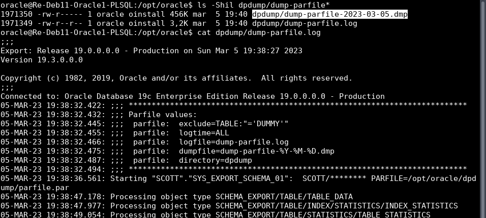

# **ASGBD - Práctica 6: Movimiento de datos**

**Tabla de contenidos:**

- [**ASGBD - Práctica 6: Movimiento de datos**](#asgbd---práctica-6-movimiento-de-datos)
  - [**Preparación del escenario en la VM con Oracle**](#preparación-del-escenario-en-la-vm-con-oracle)
  - [**Ejercicio 1**](#ejercicio-1)
  - [**Ejercicio 2**](#ejercicio-2)
  - [**Ejercicio 3**](#ejercicio-3)
  - [**Ejercicio 4**](#ejercicio-4)
  - [**Ejercicio 5**](#ejercicio-5)
  - [**Ejercicio 6**](#ejercicio-6)
  - [**Ejercicio 7**](#ejercicio-7)

---

**⚠️ En esta documentación he evitado explicar excesivamente la sintaxis de los comandos utilizados en aquellos ejercicios en los que no se pedía, en su lugar, he preferido enlazar a la documentación de la cual me he valido para realizar la práctica. Espero que sea de utilidad a aquellos que quieran profundizar en el tema. Si en el futuro algún enlace dejase de estar disponible, siempre vale la pena probar a introducir su URL en la [Wayback Machine](https://web.archive.org/). ⚠️**

---

## **Preparación del escenario en la VM con Oracle**

1. Entrar en SQLPlus como administrador.

    ```bash
    sqlplus / as sysdba
    ```

2. Habilitar el modo script y la salida por pantalla:

    ```sql
    ALTER SESSION SET "_ORACLE_SCRIPT"=TRUE;
    SET SERVEROUT ON;

    CL SCR
    ```

## **Ejercicio 1**

> **1. Realiza una exportación del esquema de SCOTT usando Oracle Data Pump con las siguientes condiciones:**
>
> **- Exporta tanto la estructura de las tablas como los datos de las mismas.**
>
> **- Excluye la tabla BONUS y los departamentos con menos de dos empleados.**
>
> **- Realiza una estimación previa del tamaño necesario para el fichero de exportación.**
>
> **- Programa la operación para dentro de 2 minutos.**
>
> **- Genera un archivo de log en el directorio raíz.**

Primero, exportaré la estructura de las tablas y los datos de las mismas, para ello comienzo creando un directorio para la exportación desde la terminal del sistema operativo y le asigno el dueño y grupo de usuario correspondiente:

```bash
mkdir /opt/oracle/dpdump

chown oracle:oinstall /opt/oracle/dpdump
```


Hecho esto, entro en SQL*Plus como administrador y creo un [objeto directorio](https://docs.oracle.com/en/database/oracle/oracle-database/21/sqlrf/CREATE-DIRECTORY.html):

```sql
CREATE DIRECTORY dpdump AS '/opt/oracle/dpdump';
```

Como haré la exportación desde el propio usuario SCOTT (esto no es necesario, se podría hacer desde el perfil de administrador pero prefiero mostrar el caso más complejo), le asigno a dicho usuario los permisos necesarios para poder leer y escribir del directorio:

```sql
GRANT READ, WRITE ON DIRECTORY dpdump TO SCOTT;
```


Además, al hacer una [exportación completa](https://docs.oracle.com/en/database/oracle/oracle-database/19/sutil/oracle-data-pump-export-utility.html#GUID-079769D8-40F4-432F-88AD-E7264D7A2E2D) debo darle también el privilegio *DATAPUMP_EXP_FULL_DATABASE*:

```sql
GRANT DATAPUMP_EXP_FULL_DATABASE TO SCOTT;
```


Ahora, desde la terminal del sistema, utilizo el comando *expdp* para realizar la exportación.

La sintaxis general es la siguiente:

```bash
expdp USUARIO/CLAVE@NOMBRE_SERVICIO DUMPFILE=NOMBRE_ARCHIVO_DATOS.dmp LOGFILE=NOMBRE_ARCHIVO_LOG.log DIRECTORY=NOMBRE_OBJETO_DIRECTORIO SCHEMAS=USUARIOS_DE_BASE_DE_DATOS CONTENT=ALL/DATA_ONLY/METADATA_ONLY ESTIMATE_ONLY=YES/NO
```

Hay que tener en cuenta que según el sistema operativo, al ejecutar el comando *expdp* puede ser necesario escapar caracteres en algunos parámetros como en el caso de *EXCLUDE=* o *QUERY=*.

Pero antes, calculo el tamaño que tendrá con el parámetro *ESTIMATE_ONLY=yes*, al ser una estimación, Oracle no permite indicar los parámetros *DUMPFILE=* ni *QUERY=*:

```bash
expdp SCOTT/TIGER DIRECTORY=dpdump LOGFILE=estimacion-scott.log EXCLUDE=TABLE:\"=\'BONUS\'\" ESTIMATE_ONLY=yes
```


La estimación indica que el volcado de datos ocupará aproximadamente 256 KB.

Ahora, realizo la exportación filtrando la tabla *BONUS* y los departamentos con menos de dos empleados:

```bash
expdp SCOTT/TIGER DIRECTORY=dpdump DUMPFILE=dump-scott.dmp LOGFILE=dump-scott.log EXCLUDE=TABLE:\"=\'BONUS\'\" QUERY=DEPT:'"WHERE DEPTNO IN (SELECT DEPTNO FROM EMP GROUP BY DEPTNO HAVING COUNT(*) >= 2)"'
```


Aunque la estimación indicaba que el volcado ocuparía 256 KB, el fichero generado ocupa 460 KB:


Los ficheros de logs contendrán la salida que hemos obtenido por terminal tanto en la estimación como en la exportación:


> **Nota: es interesante mencionar que el comando expdp soporta el parámetro PARFILE= que permite indicar un fichero de texto con los parámetros que se desean utilizar. Esto es muy útil cuando se tienen que realizar varias exportaciones con los mismos parámetros, ya que no es necesario escribirlos cada vez.**

Links a documentación de interés:

- [Oracle Base](https://oracle-base.com/articles/10g/oracle-data-pump-10g)

- [Documentación oficial de Oracle](https://docs.oracle.com/en/database/oracle/oracle-database/21/sutil/oracle-data-pump-export-utility.html)

- [Oracle Tutorial](https://www.oracletutorial.com/oracle-administration/oracle-expdp/)

- [Oracle Database – Sintaxis del Comando EXPDP/IMPDP – Exportación/Importación Lógica de datos Oracle](https://todotutto.wordpress.com/2019/02/02/oracle-database-sintaxis-del-comando-expdp-exportacion-logica-de-datos-oracle/)

- [DATAPUMP: Cómo funcionan los parámetros DUMPFILE, FILESIZE Y PARALLEL en un expdp](https://www.linkedin.com/pulse/datapump-c%C3%B3mo-funcionan-los-par%C3%A1metros-dumpfile-y-en-un-eini-trujillo/)

## **Ejercicio 2**

> **2. Importa el fichero obtenido anteriormente usando Oracle Data Pump pero en un usuario distinto de la misma base de datos.**

Para realizar este ejercicio, he creado un usuario llamado *EVA01* que será sobre el que importaré el volcado de datos, es importante ejecutar antes el comando *ALTER SESSION* del apartado [**Preparación del escenario en la VM con Oracle**](#preparación-del-escenario-en-la-vm-con-oracle). Dejo las instrucciones de creación del usuario que yo he utilizado, son las mismas que usé para el usuario SCOTT:

```bash
sqlplus / as sysdba
```

```sql
CREATE USER EVA01 IDENTIFIED BY EVA01;

ALTER USER EVA01 ACCOUNT UNLOCK;

GRANT CONNECT, RESOURCE TO EVA01;

GRANT UNLIMITED TABLESPACE TO EVA01;

ALTER USER EVA01 DEFAULT TABLESPACE USERS;

ALTER USER EVA01 TEMPORARY TABLESPACE TEMP;
```


Ahora, concedo los privilegios necesarios para que el usuario *EVA01* pueda importar el volcado de datos:

```sql
GRANT READ, WRITE ON DIRECTORY dpdump TO EVA01;

GRANT IMP_FULL_DATABASE TO EVA01;
```


Hecho esto, desde la terminal del sistema, utilizo el comando *impdp* para realizar la importación:

```bash
impdp EVA01/EVA01 DIRECTORY=dpdump DUMPFILE=dump-scott.dmp LOGFILE=imp-scott-eva01.log REMAP_SCHEMA=SCOTT:EVA01
```

La opción *REMAP_SCHEMA* permite cambiar el nombre del esquema de origen por el de destino, en este caso, el esquema *SCOTT* se importará con el nombre *EVA01*. Si no especificamos esta opción, el esquema de destino será el mismo que el de origen y se producirán errores de duplicidad de objetos.

Pese a recibir un par de errores, la importación se ha realizado correctamente:


El fichero de logs, de nuevo contiene el mismo texto que hemos obtenido en la salida por terminal:


Podemos corroborarlo accediendo a la base de datos y comprobando que el usuario *EVA01* tiene las tablas y registros que se esperan:

```bash
sqlplus EVA01/EVA01
```

```sql
SELECT * FROM EMP;
```


```sql
SELECT * FROM DEPT;

SELECT * FROM SALGRADE;

SELECT * FROM DUMMY;

SELECT * FROM BONUS;
```


Como podemos ver, las tablas del usuario *EVA01* son las mismas que las del usuario *SCOTT* a excepción de la tabla *BONUS* que no se incluyó en el volcado, y los registros son los mismos a excepción de los departamentos con menos de dos empleados que no se han importado. Podemos comprobarlo si revisamos los departamentos de ambos usuarios:

```bash
sqlplus / as sysdba
```

```sql
SELECT * FROM SCOTT.DEPT ORDER BY DEPTNO;

SELECT * FROM EVA01.DEPT ORDER BY DEPTNO;
```


Links a documentación de interés:

- [Documentación oficial de Oracle](https://docs.oracle.com/en/database/oracle/oracle-database/21/sutil/oracle-datapump-import-utility.html)

- [Oracle Base](https://oracle-base.com/articles/10g/oracle-data-pump-10g)

## **Ejercicio 3**

> **3. Realiza una exportación de la estructura de todas las tablas de la base de datos usando el comando *expdp* de Oracle Data Pump probando al menos cinco de las posibles opciones que ofrece dicho comando y documentándolas adecuadamente.**

Podemos ver todas las opciones que ofrece el comando *expdp* con:

```bash
expdp HELP=y
```


En la salida del comando podemos ver todas las opciones que ofrece y su descripción, pero también podemos consultar la lista online en [la documentación oficial de Oracle](https://docs.oracle.com/en/database/oracle/oracle-database/21/sutil/oracle-data-pump-export-utility.html#GUID-33880357-06B1-4CA2-8665-9D41347C6705). Dejo a continuación una selección de opciones que he traducido ya que he considerado importantes, los valores por defecto se muestran entre corchetes \[así\]:

- **DIRECTORY**: objeto directorio que se utilizará para los volcados y logs.

- **DUMPFILE**: especifica la lista de archivos de volcado a generar. Es importante saber que este parámetro admite una lista de variables en el nombre del archivo a generar, como *%U*, que se sustituirá por un número de dos cifras entre el 01 y el 99, incrementando su valor cada ejecución. Podemos consultar la lista completa de variables y su uso [aquí](https://docs.oracle.com/en/database/oracle/oracle-database/19/sutil/oracle-data-pump-export-utility.html#GUID-A6300021-419F-4C1D-AFF1-38FE1123326B).

- **EXCLUDE**: excluye tipos de objetos. Por ejemplo: EXCLUDE=SCHEMA:"='HR'".

- **FILESIZE**: indica el tamaño de cada archivo de volcado en bytes.

- **FULL**: exporta la base de datos completa [NO]. Requiere del privilegio *EXP_FULL_DATABASE*.

- **INCLUDE**: incluye tipos de objetos. Por ejemplo: INCLUDE=TABLE_DATA.

- **LOGFILE**: especifica el nombre del fichero de log [export.log].

- **LOGTIME**: hace que los mensajes que se muestran durante las operaciones de exportación tengan una marca de tiempo. Los valores válidos son: ALL, [NONE], LOGFILE y STATUS.

- **METRICS**: reporta métricas (información) adicionales al fichero de log [NO].

- **PARALLEL**: modifica el número de procesos simultáneos para la exportación. Esto no quiere decir que en un solo archivo se vuelque información de forma simultánea desde varios procesos, sino que se usará un proceso diferente y simultáneo para escribir en cada archivo de volcado que se cree, por lo que no tiene sentido usar esta opción para volcados de archivo único. Cabe destacar que sólo está disponible en la edición Enterprise.

- **PARFILE**: permite indicar un archivo con los parámetros como expliqué en la nota del [**Ejercicio 1**](#ejercicio-1).

- **QUERY**: permite filtrar el conjunto de datos exportados como hicimos en el [**Ejercicio 1**](#ejercicio-1), donde únicamente exportamos los departamentos con 2 o más empleados. Por ejemplo: QUERY=employees:"WHERE department_id > 10".

- **REUSE_DUMPFILES**: sobrescribe el *DUMPFILE* indicado si existiese [NO].

- **SCHEMAS**: lista de esquemas a exportar, por defecto se utiliza el mismo con el que se hace login.

- **TABLES**: indica una lista de tablas a exportar. Si no se incluye se exportarán todas las que contenga el esquema. Por ejemplo: TABLES=HR.EMPLOYEES,SH.SALES:SALES_1995.

- **TABLESPACES**: indica una lista de tablespaces a exportar.

Respecto al requerimiento del ejercicio, ya documenté detalladamente una exportación con 5 opciones diferentes en el [**Ejercicio 1**](#ejercicio-1): *DIRECTORY*, *DUMPFILE*, *LOGFILE*, *EXCLUDE* y *QUERY*. Por lo que esta vez, en lugar de documentar de nuevo el mismo proceso, utilizaré la opción *PARFILE*, la cual me parece extremadamente importante y útil para un administrador de bases de datos.

Lo primero, crear el archivo de parámetros:

```bash
nano -cl /opt/oracle/dpdump/parfile.par
```

Contenido del fichero:

```bash
DIRECTORY=dpdump
DUMPFILE=dump-parfile-%Y-%M-%D.dmp
LOGFILE=dump-parfile.log
LOGTIME=ALL
EXCLUDE=TABLE:"='DUMMY'"
```

Ahora, ejecutamos el comando *expdp* con el parámetro *PARFILE* indicando el archivo de parámetros que acabamos de crear:

```bash
expdp SCOTT/TIGER PARFILE=/opt/oracle/dpdump/parfile.par
```

Podemos ver que esta vez, al incluir el parámetro *LOGTIME*, los mensajes que se muestran durante la ejecución del comando tienen una marca de tiempo al milisegundo:


Igualmente, contaremos con dichas marcas de tiempo en el fichero de log. Y si listamos los ficheros, veremos que el archivo de volcado (*dump-parfile-2023-03-05.dmp*) se ha generado con el año, mes y día en su nombre, esto es debido a las variables *%Y*, *%M* y *%D* que he incluido en el parámetro *DUMPFILE*:



> **Curiosidad: mientras buscaba en la documentación me he encontrado con que Oracle ha pasado por alto sustituir el placeholder que usan para el nombre del parámetro en su documentación, [aquí](https://docs.oracle.com/en/database/oracle/oracle-database/21/sutil/oracle-data-pump-export-utility.html#GUID-65DCC12E-E370-46E0-86C0-4EDFDD78DF25) podemos ver que aparece *xxx* en lugar de *REUSE_DUMPFILES*.**

## **Ejercicio 4**

> **4. Intenta realizar operaciones similares de importación y exportación con las herramientas proporcionadas con MySQL desde línea de comandos, documentando el proceso.**


## **Ejercicio 5**

> **5. Intenta realizar operaciones similares de importación y exportación con las herramientas proporcionadas con Postgres desde línea de comandos, documentando el proceso.**


## **Ejercicio 6**

> **6. Exporta los documentos de una colección de MongoDB que cumplan una determinada condición e impórtalos en otra base de datos.**


## **Ejercicio 7**

> **7. SQL\*Loader es una herramienta que sirve para cargar grandes volúmenes de datos en una instancia de ORACLE. Exportad los datos de una base de datos completa desde Postgres a texto plano con delimitadores y emplead SQL\*Loader para realizar el proceso de carga de dichos datos a una instancia ORACLE. Debéis documentar todo el proceso, explicando los distintos ficheros de configuración y de log que tiene SQL\*Loader.**


---

✒️ **Documentación realizada por Juan Jesús Alejo Sillero.**
